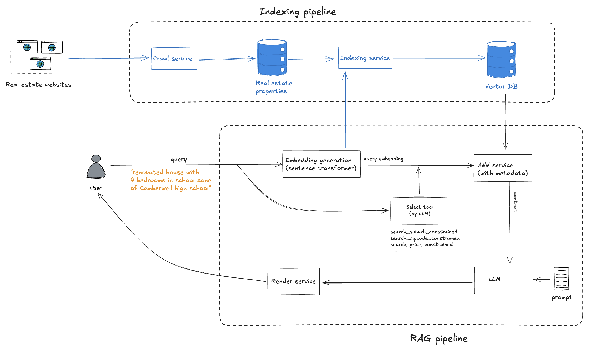

Crawl real estate data, then build RAG. There's another version that uses MCP, refer to the repo `realestate-rag-mcp`

---

# RealEstate RAG

A Retrieval-Augmented Generation (RAG) system for searching and answering questions about real estate properties in Australia. This project enables you to download property data, populate a vector database for semantic search, and run a FastAPI server to provide a natural language property search API.

The system includes an indexing pipeline and a RAG pipeline as described in the diagram below


##Example

**Query**
```bash
curl -X POST "http://localhost:8000/query" \
     -H "Content-Type: application/json" \
     -d '{"query": "renovated house with 4 bedrooms in school zone of Camberwell  high school"}'
```

**Output**

> Based on the provided property descriptions, the property that best fits the criteria of a renovated house with 4 bedrooms in the school zone of Camberwell High School is:
>
>[#4 East Court, Camberwell VIC 3124](https://www.domain.com.au/4-east-court-camberwell-vic-3124-2019595429)
>
> Resting in the bowl of a leafy court, this elegant five-bedroom (or four-bedroom plus study) weatherboard home has been beautifully renovated for luxurious family living.
>
>
> This property is located in the school zone of Camberwell High School."


## Features

- Download property details and auction results
- Populate a Chroma vector database with property data
- Semantic and filtered search over property listings
- FastAPI endpoint for natural language property queries

---

## 1. Download Data with `run_ingest_pipeline`

This script downloads property details and auction results for a given city and date range.

**Usage:**

```sh
python -m cli.run_ingest_pipeline <city> <start_date> <end_date>
```

- `<city>`: Name of the city (e.g., `melbourne`)
- `<start_date>`: Start date in `YYYY-MM-DD` format (e.g., `2025-02-01`)
- `<end_date>`: End date in `YYYY-MM-DD` format (e.g., `2025-05-10`)

**Example:**

```sh
python -m cli.run_ingest_pipeline melbourne 2025-02-01 2025-05-10
```

This will download property data for Melbourne between February 1, 2025 and May 10, 2025.

---

## 2. Populate the Vector Database with `populate_collection`

This script populates a Chroma vector database collection with property details for semantic search.

**Usage:**

```sh
python -m cli.populate_collection.py <collection_name> <property_details_path>
```

- `<collection_name>`: Name of the ChromaDB collection to populate (e.g., `melbourne`)
- `<property_details_path>`: Path to the property details JSONL file (e.g., `downloaded_data/property_details.jsonl`)

**Example:**

```sh
python -m cli.populate_collection.py melbourne downloaded_data/property_details.jsonl
```

---

## 3. Start the API Server with `run_rag`

This script starts a FastAPI server that exposes a `/query` endpoint for natural language property search.

**Usage:**

```sh
uvicorn cli.run_rag:app
```

The API will be available at `http://localhost:8000` by default.

### Querying the API

Send a POST request to `/query` with a JSON body:

```json
{
  "query": "3 bedroom house in Richmond with a pool"
}
```

**Example using `curl`:**

```sh
curl -X POST "http://localhost:8000/query" \
     -H "Content-Type: application/json" \
     -d '{"query": "3 bedroom house in Richmond with a pool"}'
```

---

## Requirements

- Python 3.10+
- Install dependencies:

  ```sh
  pip install -r requirements.txt
  ```

- Set the `API_KEY` environment variable for OpenAI access:

  ```sh
  export API_KEY=sk-...
  ```

---

## Project Structure

- `cli/` — Command-line scripts for data ingestion, population, and API
- `realestate_rag/` — Core modules for embedding, search, and RAG logic
- `tests/` — Unit tests

---

## License

MIT

---

Repository initiated with [fpgmaas/cookiecutter-uv](https://github.com/fpgmaas/cookiecutter-uv).
